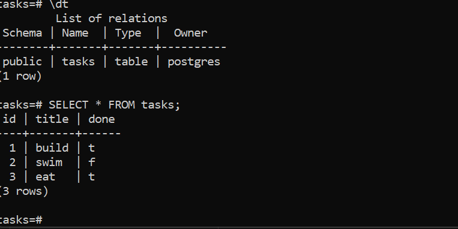

# Task API

## Why Postgres + Docker
SQLite stored everything in a single file on one machine, which works for 
small projects but doesn't scale to real production use. Postgres runs as 
an actual database server, the kind used in real applications with many 
users and connections. Docker Compose packages the whole stack — the API 
and the database — so anyone can get it running with one command 
(`docker compose up`), without installing Python, Postgres, or anything 
else manually.

## How to run
1. cp .env.example .env

2. Run:
```
docker compose up
```
3. The API will be available at http://localhost:3000

## Environment variables
See `.env.example` for the required variable: `DATABASE_URL`.


## Example query (Stage 4)
```sql
SELECT * FROM tasks WHERE done = 1;
```
This query returns all the tasks in the tasks table whose `done` status is completed.

## Database screenshot


## Endpoints

| Method | Path | Description |
|--------|------|-------------|
| GET | / | API info (name, version, endpoints) |
| GET | /health | Health check |
| GET | /tasks | List all tasks (supports ?search=, ?done=) |
| GET | /tasks/{id} | Get a single task |
| GET | /stats | Get the total, completed, and incomplete task counts |
| POST | /tasks | Create a new task |
| PUT | /tasks/{id} | Update a single task |
| DELETE | /tasks/{id} | Delete a single task |


## Postgres data screenshot


## Example request

```
curl -i http://localhost:3000/tasks
```

```
HTTP/1.1 200 OK
date: Sun, 09 Aug 2026 15:50:05 GMT
server: uvicorn
content-length: 50
content-type: application/json
[[1,"build",true],[3,"eat",true],[2,"swim",false]]
```

